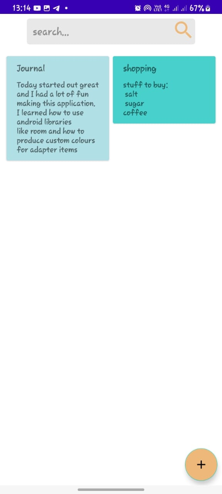
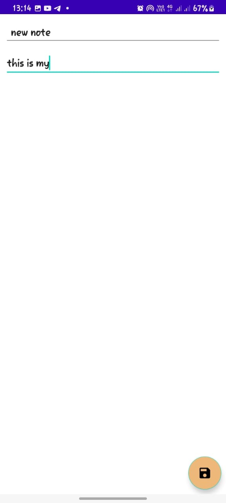

# NoteApp
This was a 1 day challenge to create a simple android application that allows users to wirte and search for notes. one can use the app to write todos as well and delete the note later.

### Architeure and libraries
Though the app is simple and can definately use a single activity, i used MVVM architecture as it allowed me to implement custome note appearance.
I used Jetpack components including:
- Room library
- Navigation components
- View Model

The app uses a Staggerd Grid recyler view and an algorithm to produce a random color for each note giving it an appealing appearance.
I used XML for the UI
### App Images

 
